# DSI Studio → Konnektom (HCP-MMP) hızlı rehberi

[English README → README.en.md](README.en.md)

DSI Studio'da **Step T3** aşamasındaki `.qsdr.fz` dosyasından başlayıp **99 demetlik traktografi**, **360 bölgeli (HCP-MMP) konnektivite matrisi** ve beyin içinde **renkli toplar + bağlantılar** görünümünü (Visualize Graph) en kısa yoldan elde etmek için adım adım, görsel anlatımlı bir rehber ve küçük Python betikleri.

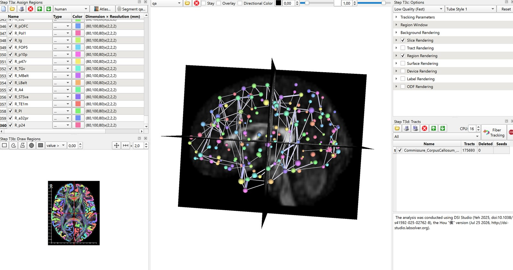

> **Kapsam:** Rehber + Python betikleri. DSI Studio komut satırı otomasyonu (`dsi_studio --action=...`) **kapsam dışıdır**; DSI Studio adımları arayüzden yapılır.
> **Veri:** Bu depoda hiçbir hasta/denek verisi yoktur ve olmamalıdır (bkz. [Gizlilik](#gizlilik)).

## Ne üretir?

Örnek önek: `s05` (kendi önekinizle değiştirin).

| # | Dosya | Nasıl oluşur |
|---|-------|--------------|
| 1 | `s05_autotrack_99bundles.tt.gz` | DSI Studio: *Recognize and Cluster* → *Tracts > Save All Tracts As* |
| 2 | `s05_autotrack_99bundles.tt.gz.txt` | DSI Studio, `.tt.gz` ile birlikte **otomatik** yazar (demet adları/indeksleri) |
| 3 | `s05_connectome_HCP-MMP_ntracts.mat` | DSI Studio: *Tracts > Connectivity matrix* → *Save matrix* |
| 4 | `s05_HCP-MMP_connectivity_for_graph.mat` | **Betik** (`graphmat`) — Visualize Graph'ın istediği `connectivity` adlı matrisi içerir |
| 5 | `s05_connectome_nodes_edges_2D.png` | **Betik** (`plot`) — 3 görünüm, top + kenar |
| 6 | `s05_connectome_nodes_edges_3D.png` | **Betik** (`plot`) |

Ek (isteğe bağlı): `s05_..._t2r.txt` (Tract-To-Region), `s05_node_metrics.csv` (betik `metrics`).

## Gereksinimler

- DSI Studio — bu rehber *Hou, 25 Temmuz 2026* sürümüyle yazıldı (Sun 2026.7.25 de önerilir). Resmî site: <https://dsi-studio.labsolver.org>. DSI Studio'yu **bu depo dağıtmaz**.
- HCP-MMP atlası DSI Studio ile gelir: `<dsi_studio>/atlas/human/HCP-MMP.nii.gz` ve `HCP-MMP.txt`.
- Python ≥ 3.10: `pip install -r requirements.txt` (numpy, scipy, nibabel, matplotlib)

## Tam yol (doğrulanmış)

Aşağıdaki sıra bu çalışmada uçtan uca denenmiştir (175.693 trakt → 99 demet → 360×360 matris).

1. **Dosyayı açın:** DSI Studio'da Step T3'te `…_s05.qsdr.fz`. *Step T3a*'da atlas klasörü `human` seçili olsun; *Step T3c*'de kalite "Low Quality (Fast)" kalabilir.
2. **Fiber Tracking** (*Step T3d*): tüm beyin traktografisi (`whole_brain`).
3. **HCP-MMP bölgelerini yükleyin** (*Step T3a: Assign Regions*): **Atlas…** düğmesine tıklayın → listeden **HCP-MMP** seçin (1) → **Select All** (2) → **Add** (3). Sol panele 360 bölge (`L_V1` … `R_p24`) gelir. **Add** kullanın, *Merge&Add* değil (o, hepsini tek bölgede birleştirir). Bu adım 5. adımdaki T2R için gereklidir.
   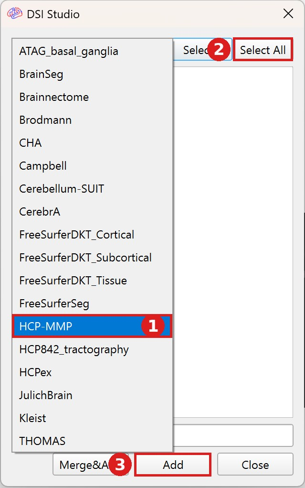
4. **Tracts Misc > Recognize and Cluster** → 99 isimli demet oluşur.
   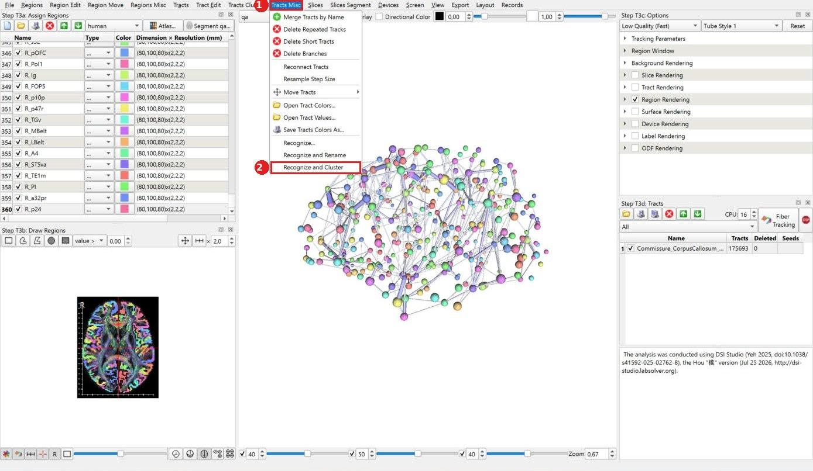
5. **Regions > Tract-To-Region Connectome (T2R)** → sonucu `_t2r.txt` olarak kaydedin (isteğe bağlı).
   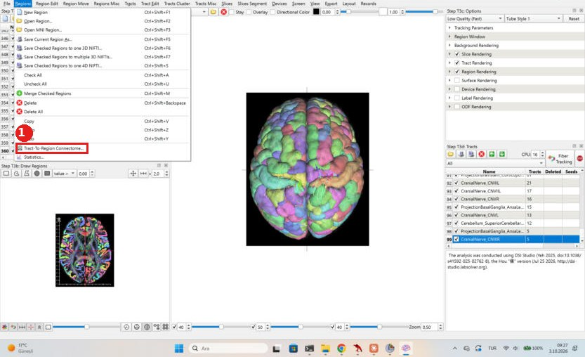
6. **Tracts > Save All Tracts As…** → `s05_autotrack_99bundles.tt.gz` (yanına `.tt.gz.txt` otomatik yazılır). Bu yedek, sonraki Merge adımından önce alınır.
   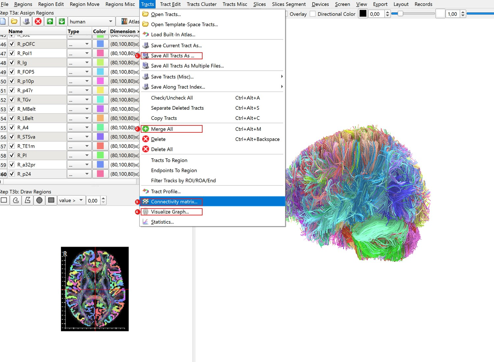
7. **Tracts > Merge All** → tüm demetler tek satırda birleşir. *Konnektivite matrisi yalnızca seçili satırdaki traktlardan hesaplanır*; birleştirmezseniz matris birkaç yüz trakttan çıkar ve çok seyrek olur.
   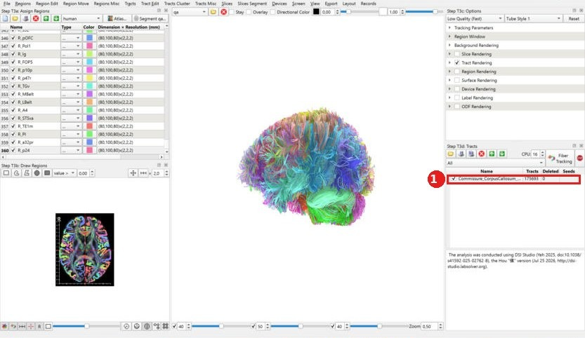
8. **Tracts > Connectivity matrix:** *Parcellation Atlas* = **HCP-MMP** (listede yanlış atlas seçmek kolaydır — kontrol edin), *pass region*, *value: number of tracts* → **Recalculate** → **Save matrix** → `s05_connectome_HCP-MMP_ntracts.mat`. DSI Studio kayıt penceresinde kendi önerdiği bir ad (ör. `Commissure_CorpusCallosum_Body_HCP-MMP.mat`) gösterebilir; bu ad birleştirilmiş satırın adından gelir ve matris yine tüm izden hesaplanmıştır. İsterseniz adı değiştirin, hangi adla kaydettiyseniz 9. adımda `--mat` yoluna onu yazın.
   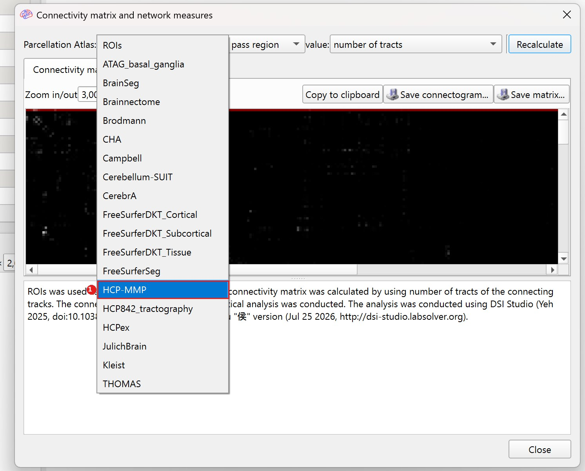
   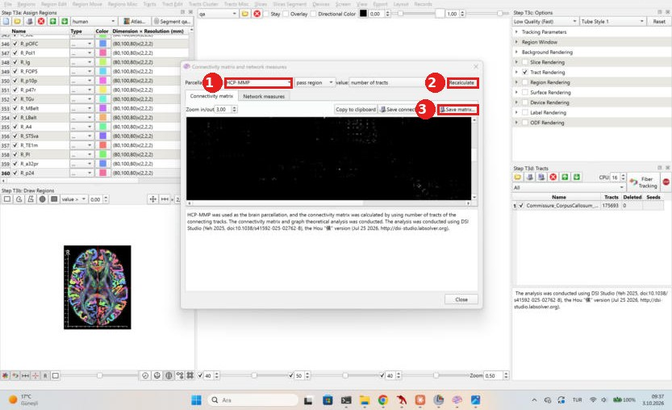
9. **Betiği çalıştırın** (aşağıda) → graph `.mat` + 2B/3B PNG.
10. **Tracts > Visualize Graph…** → `s05_HCP-MMP_connectivity_for_graph.mat`. *Step T3c: Options*'ta **Region Rendering ✔, Tract Rendering ☐** yapın → kapak görüntüsü.
   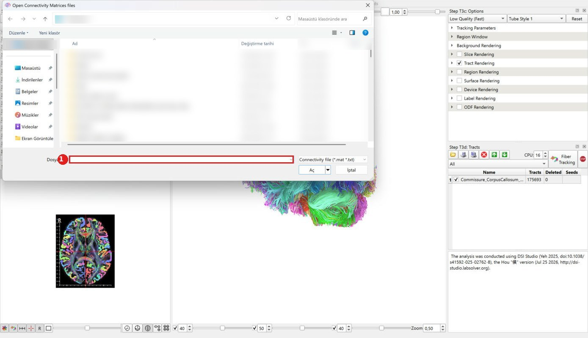

### Neden 4. dosya (betik)?

Bu DSI Studio sürümünde *Save matrix* dosyası "Visualize Graph" için gereken `connectivity` adlı matrisi içermiyor ve şu hata çıkıyor: *"Cannot find a matrix named connectivity"*.
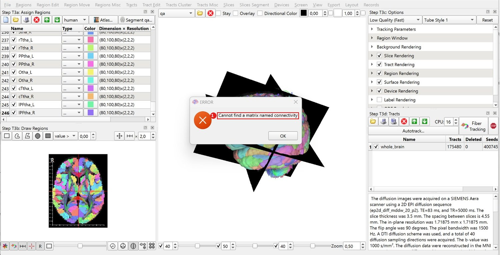
`graphmat` alt komutu `number of tracts r2r` matrisini `connectivity` adıyla yeniden yazar. Bu, DSI Studio'nun yazdığı MATLAB v4 biçimiyle uyumludur (gerçek `s05` verisinde elle üretilen dosya ile birebir aynı sonuç verdi).

## Hızlı yol (daha kısa)

4–7. adımları atlayıp **doğrudan `whole_brain` satırıyla** 8–10'a geçebilirsiniz (3. adımı yapmanız zarar vermez; matris için gerekli olduğunu düşünmüyorum, ama atlayarak denemedim).

- **Neden aynı sonucu vermesi beklenir:** `s05` verisinde Recognize and Cluster, 175.693 traktın **tamamını** 99 demetten birine atadı (`.tt.gz` içindeki `cluster` alanı 0–98 arası, atanmamış trakt yok). Merge All bu demetleri geri birleştirdiğinden matrisin hesaplandığı trakt kümesi `whole_brain` ile aynıdır (aynı 175.693 trakt).
- **Doğrulama durumu:** Brainnectome atlasıyla `whole_brain` satırından doğrudan matris alınıp çalıştığı görüldü. HCP-MMP ile bu kısayol arayüzde **ayrıca denenmedi**; yukarıdaki eşdeğerlik mantıksaldır. Siz denerseniz sonucu bir *issue* ile bildirin.
- **Ne kaybedilir:** 1–2 numaralı dosyalar (99 demet `.tt.gz` ve `.tt.gz.txt`) çıkmaz, çünkü Recognize and Cluster atlanır. Bu dosyalar `qc` komutu ve demet bazlı analiz için gereklidir.

## Betik kullanımı

Betik, DSI Studio'nun kaydettiği `.mat` dosyasından graph dosyasını ve 2B/3B resimleri üretir. **Windows PowerShell'de** önce aşağıdaki 4 satırda yalnızca yazılı yolları kendi bilgisayarınıza göre düzenleyin (`KULLANICI` ve dosya adı), sonra komutları **aynen** yapıştırın.

```powershell
# 1) Bu 4 satırı kendinize göre düzenleyin
$repo  = "C:\Users\KULLANICI\Desktop\son_dti_kurs\dsistudio-connectome-guide"
$mat   = "C:\Users\KULLANICI\Desktop\son_dti_kurs\KAYDETTIGINIZ_DOSYA.mat"
$atlas = "C:\Users\KULLANICI\Desktop\son_dti_kurs\dsi_studio_win\atlas\human"
$tt    = "C:\Users\KULLANICI\Desktop\son_dti_kurs\s05_autotrack_99bundles.tt.gz"
```

```powershell
# 2) Bunları aynen yapıştırın (düzenlemeyin)
cd $repo
pip install -r requirements.txt
python scripts\connectome_tools.py all --mat $mat --atlas-dir $atlas --prefix s05
```

`$mat`, DSI Studio'da *Save matrix* ile **sizin** kaydettiğiniz dosyanın tam yolu olmalıdır (ör. `...\Commissure_CorpusCallosum_Body_HCP-MMP.mat`). Yanlış yazarsanız betik, o klasördeki `.mat` dosyalarını listeler. Komutları DSI Studio klasöründe değil, **bu deponun klasöründe** çalıştırın (yukarıdaki `cd $repo` bunu yapar).

`all` komutu yeterlidir. Aşağıdakiler isteğe bağlıdır ve her biri `all`'ın bir parçasını ya da ek bir analizi tek başına yapar; aynı değişkenlerle (`$mat`, `$atlas`, `$tt`) aynen yapıştırabilirsiniz:

```powershell
python scripts\connectome_tools.py inspect  --mat $mat                                  # .mat içindeki matrisleri listeler
python scripts\connectome_tools.py graphmat --mat $mat --prefix s05                      # yalnız Visualize Graph için .mat
python scripts\connectome_tools.py plot     --mat $mat --atlas-dir $atlas --prefix s05   # yalnız 2B/3B resim
python scripts\connectome_tools.py metrics  --mat $mat --atlas-dir $atlas --prefix s05   # düğüm metrikleri CSV
python scripts\connectome_tools.py qc       --tt $tt                                     # trakt/demet kalite kontrolü
```

**Linux / macOS / Git Bash** için aynı komutlar (satır sonundaki `\` bash içindir):

```bash
pip install -r requirements.txt
python scripts/connectome_tools.py all \
    --mat  ~/KAYDETTIGINIZ_DOSYA.mat \
    --atlas-dir "<dsi_studio>/atlas/human" \
    --prefix s05
```

Çizim: düğüm = atlas bölgesinin ağırlık merkezi (MNI), boyut = güç (strength), turuncu = sol, mavi = sağ yarıküre; çizgi = en güçlü `--top-edges` bağlantı. Örnekler: [`examples/`](examples).

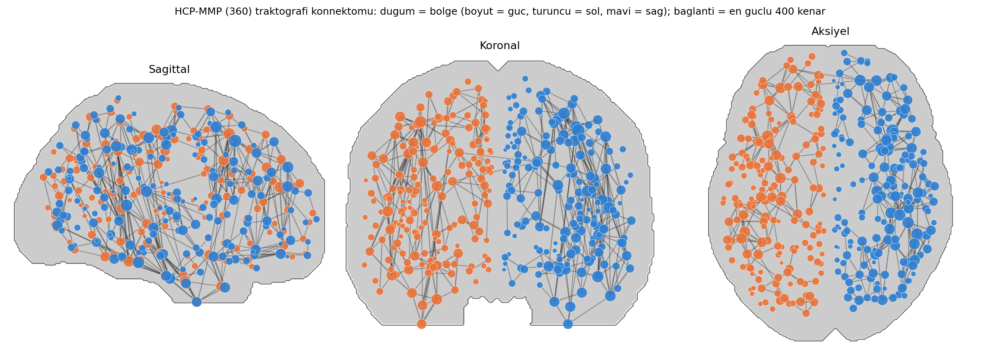

Testler: `pip install -r requirements-dev.txt && pytest -q`

## Sonra ne yapılır?

1. **Kalite kontrolü (önce bunu yapın).** `python scripts/connectome_tools.py qc --tt s05_autotrack_99bundles.tt.gz` komutu trakt uzunluklarını, komisural demetlerin payını ve her demette iki ucu **farklı yarıkürede** biten trakt oranını verir. Örnek `s05` verisinde:
   - Komisural demetler traktların %19,8'i, ama matriste sol↔sağ bağlantı yalnızca toplam ağırlığın **%2,3**'ü.
   - Bunun nedeni matris hesabı değil: `.tt.gz`'den matrisi bağımsız olarak yeniden hesapladığımızda (pass modu) DSI Studio matrisiyle korelasyon 0,98 ve aynı %2,3 çıktı.
   - Asıl neden izlerin kısa/parçalı olması: Corpus Callosum Body için medyan uzunluk 52 mm ve traktların yalnızca %19'unun iki ucu karşı yarıkürede. Corpus callosum izleri karşı korteks etiketlerine varamadan bitiyor; sonuç olarak sol↔sağ bağlantılar matriste **eksik temsil ediliyor**.
   - Bu nedenle bu veriden hemisferler arası bağlantı güçleri hakkında yorum yapmayın; yarıküre içi bağlantılar daha güvenilir. Traktografi parametreleri (minimum/maksimum uzunluk, QA eşiği, açı eşiği, adım boyu, seed sayısı) ve veri kalitesi (b-değeri, çözünürlük) etkili olabilir; bu parametrelerin etkisi bu depoda **denenmedi**.
2. **Normalizasyon.** Ham "number of tracts" bölge hacmine, toplam trakt sayısına ve traktografi parametrelerine bağlıdır. Bireyler/gruplar arasında karşılaştırmadan önce normalize edin (ör. toplam trakta bölme, bölge boyutuna göre düzeltme) ya da DSI Studio'daki diğer ölçümleri (ör. *mean length*, QA/FA-ağırlıklı) kullanın.
3. **Graf metrikleri.** Derece/güç, kümeleme katsayısı, global/yerel verimlilik, modülerlik, hub'lar. Hazır kütüphaneler: [bctpy](https://github.com/aestrivex/bctpy), [networkx](https://networkx.org). Eşikleme (ör. en güçlü %10 veya yoğunluk-eşleştirilmiş) sonuçları değiştirir; birden fazla eşikte sağlamlığı gösterin.
4. **Demet bazlı analiz.** `.tt.gz` dosyasını DSI Studio'da açıp demet başına QA/FA/uzunluk istatistiklerini (Tracts > Statistics) alın; 99 demet adları `.tt.gz.txt` içindedir.
5. **Grup karşılaştırması.** Kenar bazlı testlerde çoklu karşılaştırma düzeltmesi (FDR) veya NBS (Network-Based Statistic) kullanın; yaş/cinsiyet/baş hareketi kovaryatlarını ekleyin.
6. **Yorum sınırları.** Traktografideki trakt sayısı akson sayısı değildir; yanlış-pozitif/negatif bağlantılar olabilir (özellikle kesişen lif bölgeleri ve uzun mesafeli yollar). Sonuçları "yapısal bağlantı kanıtı" olarak değil "traktografi tabanlı bağlantı tahmini" olarak raporlayın.

## Sorun giderme

[`docs/TROUBLESHOOTING.md`](docs/TROUBLESHOOTING.md): tek satır seçiliyken matris, yanlış atlas, `connectivity` hatası, Region/Tract Rendering, ikinci DSI Studio penceresi/lisans, 246 ↔ 248 bölge hatası.

## Gizlilik

- `.fz`, `.tt.gz`, `.mat`, `.nii.gz` dosyaları `.gitignore` ile dışarıda tutulur. **Hasta/denek verisini asla commit etmeyin**; dosya adları (ör. tarih_yaş_AD-SOYAD içeren `.qsdr.fz` adları) ve ekran görüntülerindeki başlık çubukları kimlik içerebilir.
- Görsellerde başlık çubukları ve kişisel klasör listeleri kırpılmış/bulanıklaştırılmıştır; kendi görüntülerinizi eklerken de yapın.
- Bu depodaki örnek PNG'ler yalnızca bölge-bölge toplu sayıdan çizilmiş, kimlik taşımayan örneklerdir.

## Lisans ve atıflar

- Bu depodaki betikler ve metin: **MIT** ([LICENSE](LICENSE)).
- **DSI Studio** ayrı bir yazılımdır ve **CC BY-NC-SA 4.0** altındadır (ticari olmayan kullanım); bu depo dağıtmaz. Atıf: Yeh F.-C. (2025) doi:10.1038/s41592-025-02762-8.
- **HCP-MMP** atlası kendi lisans/kullanım koşullarına tabidir ve bu depoda dağıtılmaz. Atıf: Glasser et al. (2016) *Nature* 536:171–178.
